# Machinery v2 架构设计与流程图

## 1. 整体架构设计图

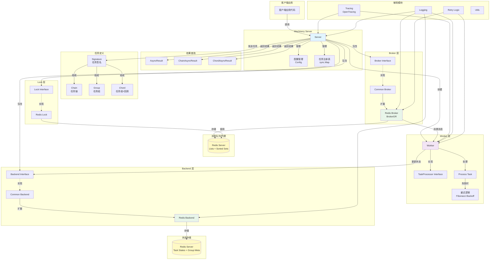

## 2. 核心组件关系图

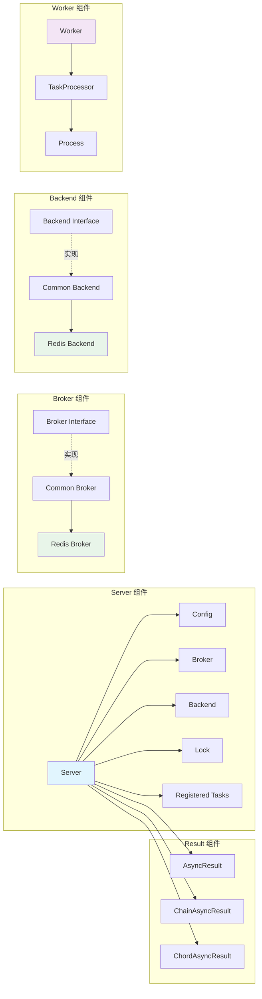

## 3. 任务发布流程图

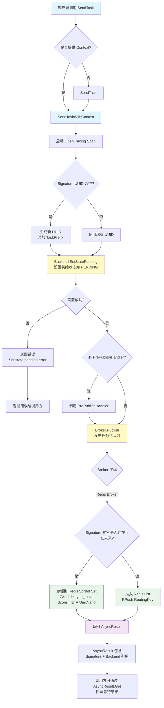

## 4. Group 任务发布流程图

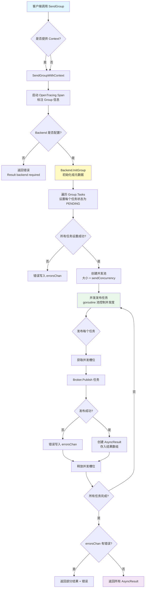

## 5. Chain 任务发布流程图

```mermaid
flowchart TD
    A[客户端调用 SendChain] --> B{是否提供 Context?}
    B -->|是| C[SendChainWithContext]
    B -->|否| D[SendChain]
    D --> C
    
    C --> E[启动 OpenTracing Span<br/>标注 Chain 信息]
    E --> F[发送 Chain.Tasks[0]<br/>第一个任务]
    
    F --> G{第一个任务发布成功?}
    G -->|否| H[返回错误]
    G -->|是| I[创建 ChainAsyncResult<br/>包含所有任务 AsyncResult]
    
    I --> J[[Chain 执行机制]]
    J --> K[任务 1 执行成功]
    K --> L[Worker.taskSucceeded<br/>触发 OnSuccess 回调]
    L --> M[将任务 1 的结果<br/>追加到任务 2 的 Args]
    M --> N[发送任务 2]
    N --> O[任务 2 执行...]
    O --> P[依此类推]
    
    I --> Q[调用方可通过<br/>ChainAsyncResult.Get<br/>等待最后一个任务结果]
    
    style A fill:#e1f5fe
    style F fill:#fff9c4
    style I fill:#f3e5f5
    style L fill:#e8f5e9
    style N fill:#e8f5e9
```

## 6. Chord 任务发布流程图

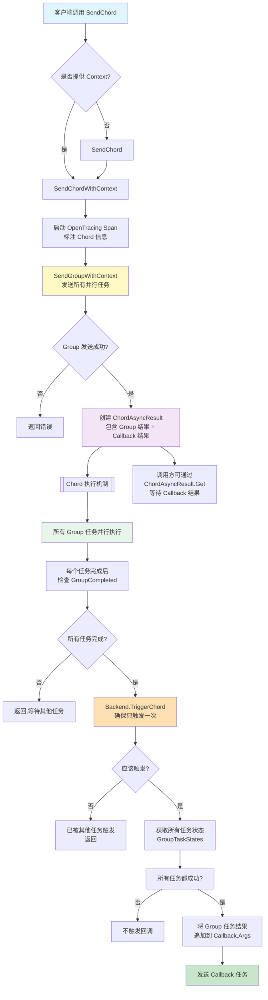

## 7. Worker 启动与消费流程图

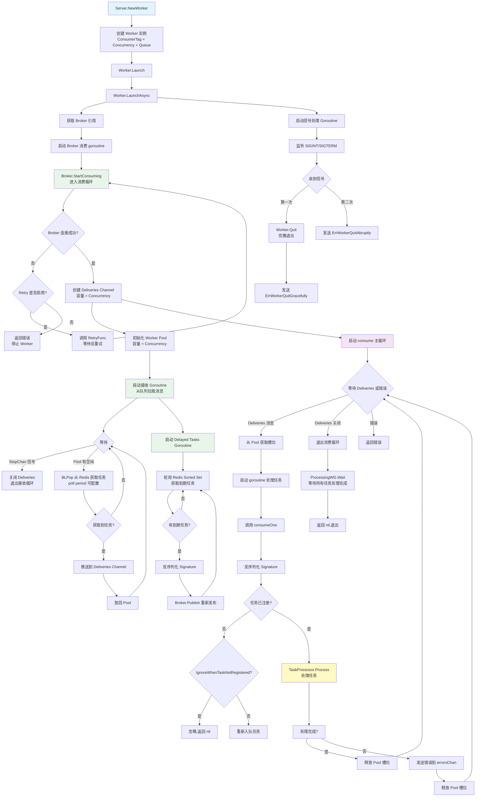

## 8. 任务处理详细流程图 (Worker.Process)

```mermaid
flowchart TD
    A[Worker.Process<br/>接收 Signature] --> B{任务已注册?}
    B -->|否| C[返回 nil<br/>不重试]
    B -->|是| D[获取任务函数]
    
    D --> E[Backend.SetStateReceived<br/>状态: RECEIVED]
    E --> F{设置成功?}
    F -->|否| G[返回错误]
    F -->|是| H[tasks.NewWithSignature<br/>准备任务执行]
    
    H --> I{准备成功?}
    I -->|否| J[taskFailed<br/>状态: FAILURE]
    J --> K[返回错误]
    
    I -->|是| L[Tracing.StartSpanFromHeaders<br/>创建/提取 Span]
    L --> M[Backend.SetStateStarted<br/>状态: STARTED]
    
    M --> N{设置成功?}
    N -->|否| O[返回错误]
    N -->|是| P{有 PreTaskHandler?}
    
    P -->|是| Q[调用 PreTaskHandler]
    P -->|否| R
    Q --> R
    
    R[注册 PostTaskHandler<br/>defer 调用] --> S[task.Call<br/>执行任务函数]
    
    S --> T{执行结果}
    T -->|成功| U[taskSucceeded]
    T -->|ErrRetryTaskLater| V[retryTaskIn<br/>指定时间后重试]
    T -->|其他错误| W{RetryCount > 0?}
    
    W -->|是| X[taskRetry<br/>默认重试逻辑]
    W -->|否| J
    
    U --> Y[Backend.SetStateSuccess<br/>状态: SUCCESS<br/>存储 Results]
    Y --> Z[记录成功日志]
    Z --> AA{有 OnSuccess 回调?}
    AA -->|是| AB[遍历 OnSuccess<br/>追加结果到 Args<br/>发送每个回调任务]
    AA -->|否| AC{GroupUUID 为空?}
    
    AB --> AC
    AC -->|是| AD[返回,任务处理完成]
    AC -->|否| AE{ChordCallback 为空?}
    AE -->|是| AD
    AE -->|否| AF[Backend.GroupCompleted<br/>检查组是否完成]
    
    AF --> AG{组完成?}
    AG -->|否| AD
    AG -->|是| AH[Backend.TriggerChord<br/>触发 Chord]
    
    AH --> AI{应该触发?}
    AI -->|否| AD
    AI -->|是| AJ[Backend.GroupTaskStates<br/>获取所有任务状态]
    AJ --> AK{所有任务成功?}
    AK -->|否| AD
    AK -->|是| AL[追加 Group 结果<br/>到 ChordCallback.Args]
    AL --> AM[发送 ChordCallback 任务]
    AM --> AD
    
    X --> AN[Backend.SetStateRetry<br/>状态: RETRY]
    AN --> AO[RetryCount--]
    AO --> AP[计算新 RetryTimeout<br/>FibonacciNext]
    AP --> AQ[设置 ETA = now + RetryTimeout]
    AQ --> AR[SendTask 重新发送]
    AR --> AD
    
    V --> AS[Backend.SetStateRetry]
    AS --> AT[设置 ETA = now + retryIn]
    AT --> AU[SendTask 重新发送]
    AU --> AD
    
    J --> AV[Backend.SetStateFailure<br/>状态: FAILURE<br/>存储 Error]
    AV --> AW{有 ErrorHandler?}
    AW -->|是| AX[调用 ErrorHandler]
    AW -->|否| AY[记录错误日志]
    AX --> AZ{有 OnError 回调?}
    AY --> AZ
    
    AZ -->|是| BA[遍历 OnError<br/>追加错误信息到 Args<br/>发送每个回调任务]
    AZ -->|否| BB{StopTaskDeletionOnError?}
    BA --> BB
    BB -->|是| BC[返回 ErrStopTaskDeletion]
    BB -->|否| BD[返回 nil]
    
    style A fill:#e1f5fe
    style E fill:#fff9c4
    style S fill:#e8f5e9
    style U fill:#c8e6c9
    style J fill:#ffcdd2
    style X fill:#ffe0b2
    style V fill:#ffe0b2
    style AH fill:#f3e5f5
    style AD fill:#b2ebf2
```

## 9. 状态流转图

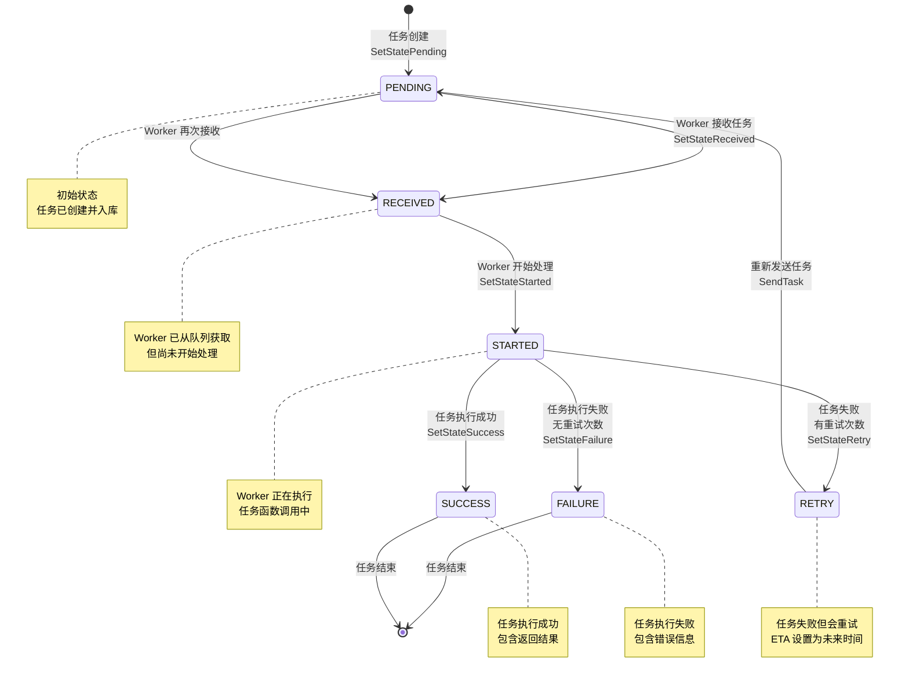

## 10. 结果获取流程图

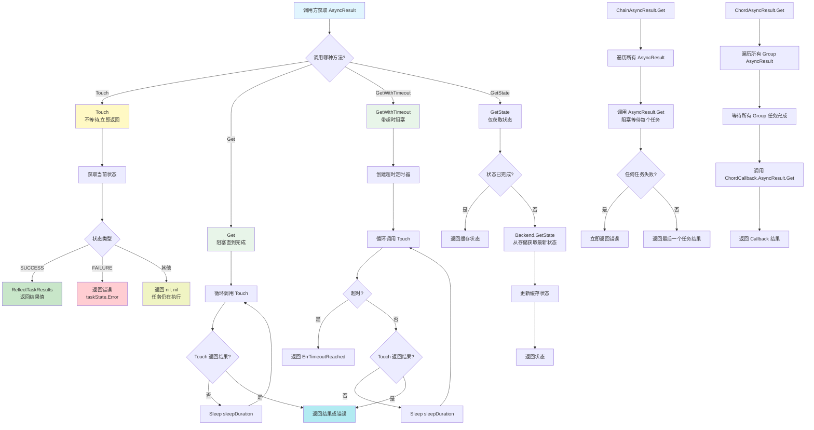

## 11. 定时任务注册与执行流程

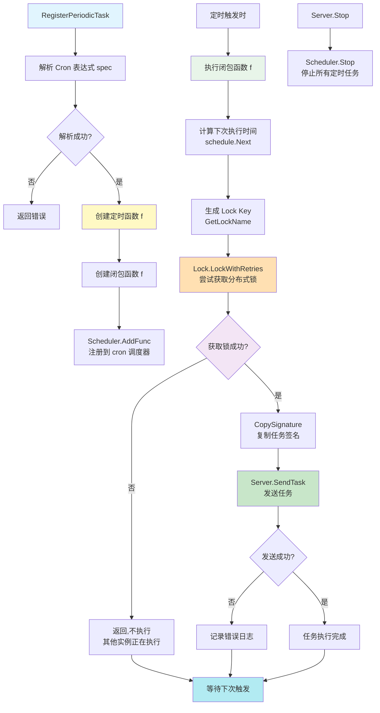

## 12. Redis Broker 消费流程图

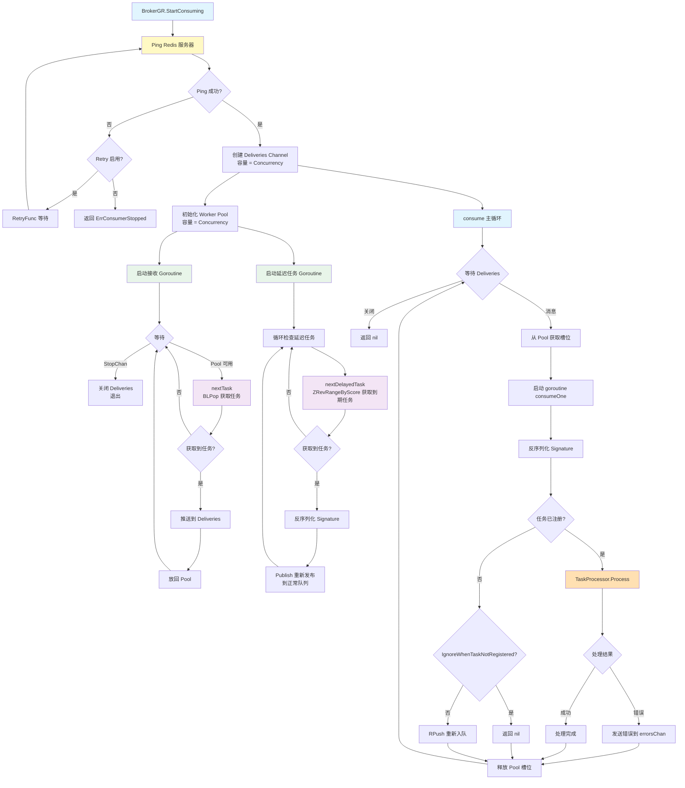

## 13. Redis 延迟任务处理流程

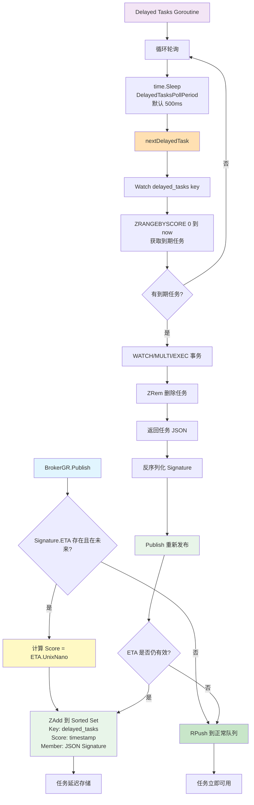

## 14. 任务重试机制流程

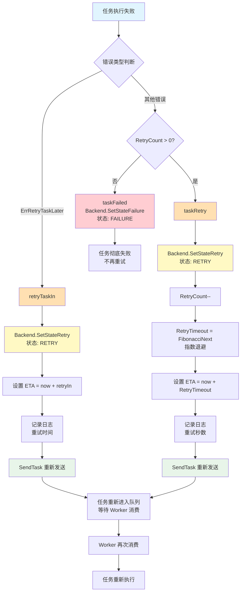

## 15. 数据流完整链路图

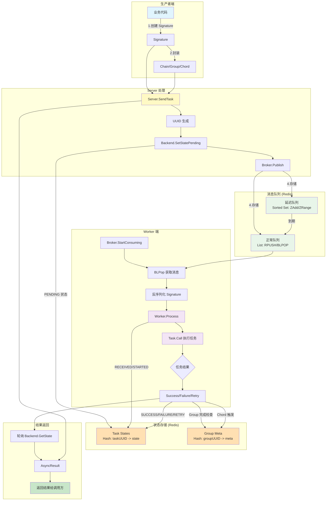

## 16. Worker 并发处理模型

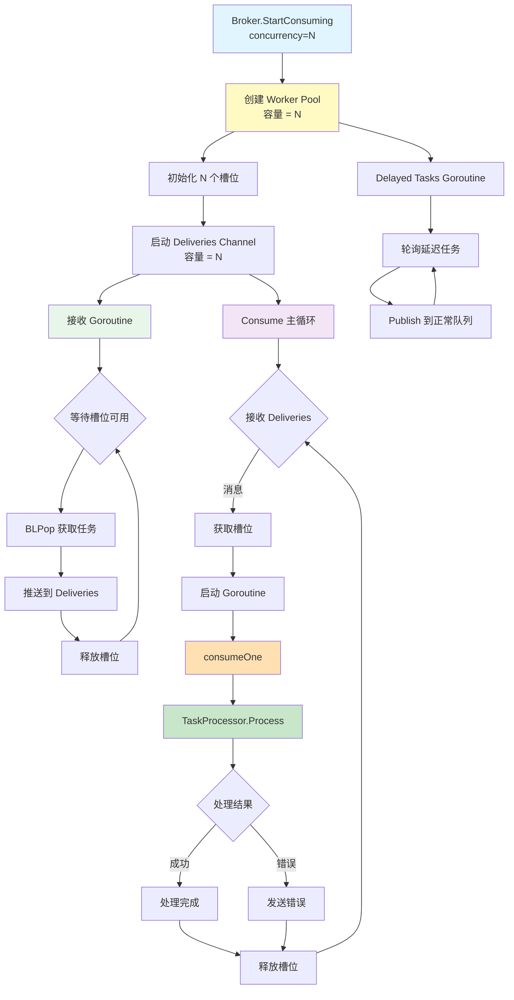

## 17. 接口依赖关系图

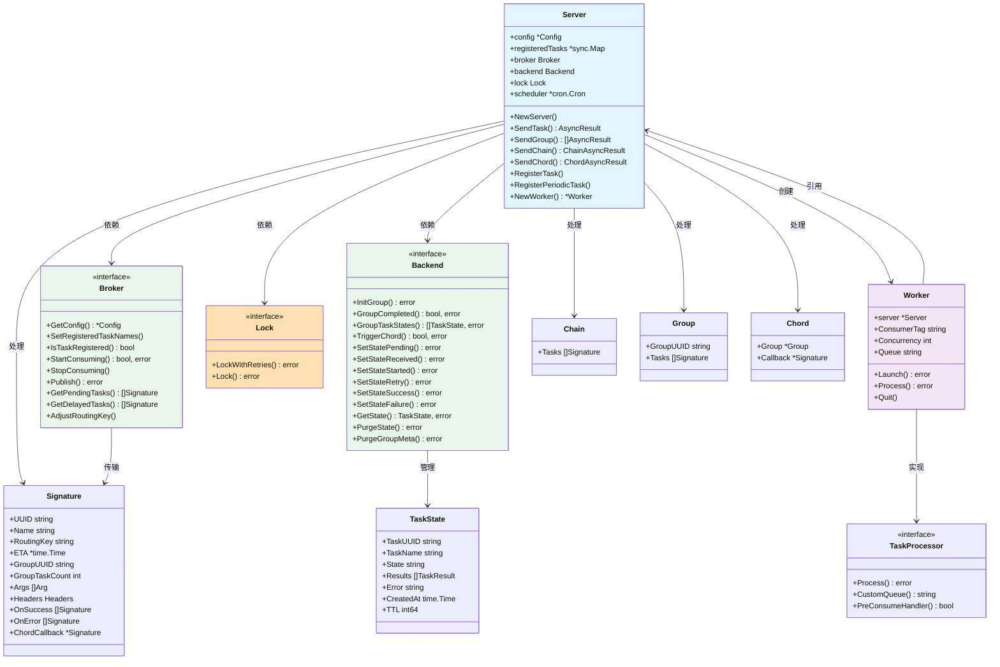

## 18. 组件交互时序图

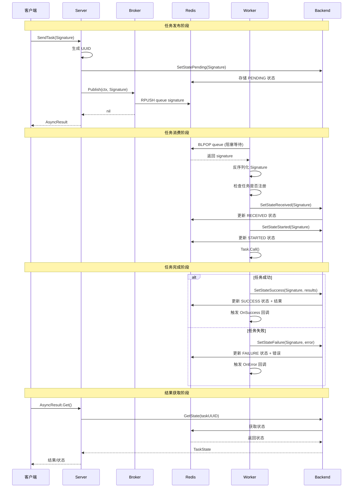

## 19. 周期性任务完整生命周期

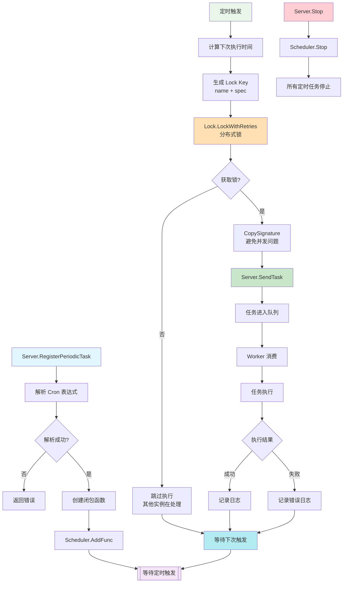

## 20. 错误处理与恢复机制

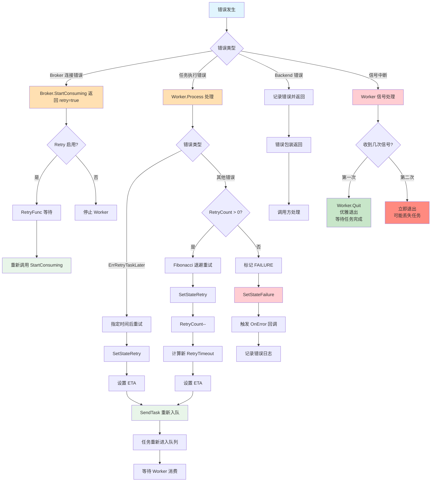

